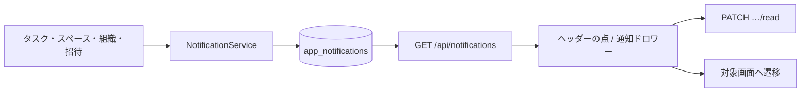

# アプリ内通知（Notification）

## 概要

ユーザー向けの**アプリ内通知**。担当の追加、期限の変更、タスクのアーカイブ／復元／完全削除、スペースへのメンバー追加、組織の役割変更、既存ユーザーへの招待を契機に `app_notifications` へ同期的に書き、グローバルヘッダーのベルから右サイドドロワー（タイトル「通知」）で一覧・既読・遷移する。

Laravel の `Notification` チャネル、Event / Listener、キューは使わない。書き込みは `NotificationService` の直接呼び出しで、リクエスト内で完了する。呼び出し元は `TaskController`、`WorkspaceController`、`OrganizationController`、および招待の `OrganizationInviteService`。ボード／WBS のリアルタイム同期（Reverb / Echo）とは独立しており、通知の配信に WebSocket は使わない。未読の有無はヘッダーがポーリングで知る。

## 本書の範囲

- アプリ内通知の現行仕様（作成トリガー、データ、API、UI）

対象外:

- メール・プッシュ等の外部チャネル（招待メールは [organization.md](./organization.md)。アプリ内通知とは別）
- ボード／タスクのリアルタイム同期（[`../../architecture/realtime/sync.md`](../../architecture/realtime/sync.md)）

関連: [`../../database/schema-notifications.md`](../../database/schema-notifications.md)

---

## 全体フロー

```
[ タスク / スペース / 組織 / 招待の処理 ]
        │ 同期呼び出し（キューなし）
        ▼
[ NotificationService ]
        │ INSERT
        ▼
[ app_notifications ]
        │
        ▼
[ GET /api/notifications ]  ← マウント時、60 秒ごと、ドロワーを開いたとき
        │
        ▼
[ AppGlobalHeader 通知ドロワー ]
        │ クリック
        ▼
[ PATCH …/read ] → 種別に応じて遷移
```



---

## データモデル

### テーブル: `app_notifications`

マイグレーション: `backend/database/migrations/2026_07_31_000004_create_notifications_table.php`  
モデル: `App\Models\Notification\AppNotification`（`backend/app/Models/Notification/AppNotification.php`）  
`$table` は `app_notifications`。

| 列 | 型 | 説明 |
| --- | --- | --- |
| `id` | bigint PK | |
| `user_id` | FK → `users` | 受信者。`cascadeOnDelete` |
| `type` | string(64) | 通知種別（後述）。DB の enum ではない |
| `data` | json | 遷移・表示用ペイロード。NOT NULL |
| `read_at` | timestamp nullable | `null` = 未読 |
| `created_at` / `updated_at` | timestamp | API の JSON には `updated_at` を出さない |

インデックス: `(user_id, read_at, created_at)`

Eloquent:

- `data` → `array` cast
- `read_at` → `datetime` cast
- `user()` BelongsTo
- `isRead()`: `read_at !== null`
- `User::appNotifications()` HasMany

通知は**ユーザー単位**。一覧 API に組織スコープは無く、複数組織の行が混在する。

---

## 通知種別と作成トリガー

永続化はすべて `App\Services\Notification\NotificationService`。**操作者本人には送らない**（`notifyMany` の除外 ID）。同じユーザー ID が複数回入っても 1 行にまとめる。`0` 以下の ID は捨てる。

| `type` | 作成タイミング | 受信者 |
| --- | --- | --- |
| `task.assigned` | タスク作成または更新で、担当者集合に**新たに入った**ユーザー | 追加された担当者。外した担当者には送らない |
| `task.due_date_changed` | **更新**で `due_date` を送り、日付（`Y-m-d` に正規化した値）が変わったとき。作成時に期限を付けてもこの種別は作らない | 更新後の担当者。操作者に加え、同じリクエストで新たに担当になった人は除く（その人は `task.assigned` のみ） |
| `task.archived` | タスクをアーカイブしたとき。一緒にアーカイブされる**直下の未アーカイブ子**にも、子ごとに 1 通 | 各タスクの担当者 |
| `task.restored` | タスクを復元したとき。一緒に復元される**直下のアーカイブ済み子**にも、子ごとに 1 通 | 各タスクの担当者 |
| `task.deleted` | アーカイブ済みタスクを完全削除する直前。対象はルートと子孫（ソフトデリート済みを含む）で、タスクごとに 1 通 | 削除前の各タスクの担当者 |
| `workspace.member_added` | スペース作成時の `assignee_ids`、またはスペース更新で `assignee_ids` に**新たに入った**ユーザー。外したメンバーには送らない | 追加されたメンバー |
| `organization.role_changed` | メンバー更新で、変更前の役割が空でなく、`admin` / `member` が実際に変わったとき。同じ役割の再送では作らない | 役割が変わった本人。自分の役割を自分で変えた場合は除外されて届かない |
| `organization.invited` | 組織招待の新規発行と、有効な招待の再送（トークン再発行）。メールは宛先へ送り、アプリ内通知は**そのメールのユーザー行があるときだけ** | メールを大文字小文字を無視して一致したユーザー。操作者は除外 |

通知しないもの: タイトル、説明、開始日、優先度、工数、進捗、チェックリスト、添付、ラベル、リスト移動、親子の付け替え、担当の解除、スペースメンバーの解除、スペースのアーカイブ、資料、組織マスタの編集、組織からの除名。アカウントの無いメールアドレスへの招待、既に組織メンバーであるアドレスへの招待（API は 422 で、通知行は作らない）もアプリ内通知は無い。

アーカイブ／復元が歩くのは直下の子だけである（タスクの親子は 1 階層）。完全削除だけ子孫をたどる。

### `data` ペイロード

| フィールド | 使う種別 |
| --- | --- |
| `task_id` / `workspace_id` / `workspace_name` / `organization_slug` / `title` / `parent_task_title` | タスク系。`title` はタスク名。`workspace_name` は作成時点のスペース名（取れなければ null）。`parent_task_title` は親があるときそのタスク名、無ければ null。`organization_slug` は組織が取れなければ null |
| `due_date` / `due_date_change` | `task.due_date_changed` のみ追加。`due_date` は `Y-m-d` または null。`due_date_change` は `set`（未設定→日付）/ `changed`（日付→別の日付）/ `cleared`（日付→未設定） |
| `workspace_id` / `workspace_name` / `organization_slug` / `title` | `workspace.member_added`。`title` と `workspace_name` はどちらもスペース名 |
| `organization_slug` / `organization_name` / `role` / `title` | `organization.role_changed`。`role` は変更後。`title` は組織名 |
| `organization_slug` / `organization_name` / `invite_token` / `role` / `title` | `organization.invited`。`invite_token` は招待 URL 用の**平文**トークン。DB の `organization_invites.token` はハッシュで、招待 API の JSON には平文を含めない。再送のときは新しい平文が入る |

---

## 表示文言

ドロワー本文は `AppGlobalHeader.vue` の `notificationLabel`。日付は別行。

名前の欠損時: タスク名は `title` が空なら「タスク」。タスク系のスペース名は `workspace_name` が空なら文面にスペースを出さない（古い通知）。親タスク名は `parent_task_title` が空なら出さない。スペースメンバー追加のスペース名は `workspace_name`、無ければ `title`、それも無ければ「スペース」。組織名は `organization_name`、無ければ `title`、それも無ければ「組織」。

タスク系の主語は次のとおり。親タスクがあるときのタスク名は `「（{親タスク名}）{タスク名}」`、無いときは `「{タスク名}」`。スペース名があるときはその前に `スペース「{スペース名}」の` を付ける。

| 条件 | 本文 |
| --- | --- |
| `task.assigned` | {主語}に担当者として追加されました |
| `task.due_date_changed` かつ `cleared`、または期限文字列が空 | {主語}の期限が削除されました |
| `task.due_date_changed` かつ `changed` | {主語}の期限が {YYYY/MM/DD} に変更されました |
| `task.due_date_changed` のそれ以外（`set`） | {主語}の期限が {YYYY/MM/DD} に設定されました |
| `task.archived` | {主語}がアーカイブされました |
| `task.restored` | {主語}が復元されました |
| `task.deleted` | {主語}が削除されました |
| `workspace.member_added` | 「{スペース名}」のメンバーに追加されました |
| `organization.role_changed` かつ `role === admin` | 「{組織名}」での役割が管理者に変更されました |
| `organization.role_changed` のそれ以外 | 「{組織名}」での役割がメンバーに変更されました |
| `organization.invited` | 「{組織名}」に招待されました |
| 上記以外 | `title`（空なら「タスク」） |

期限の表示は `due_date` 先頭の `YYYY-MM-DD` を `YYYY/MM/DD` にしたもの。その形でなければ文字列をそのまま出す。

---

## NotificationService

ファイル: `backend/app/Services/Notification/NotificationService.php`

| メソッド | 挙動 |
| --- | --- |
| `notify(User\|int $user, string $type, array $data): AppNotification` | 1 行 INSERT。`read_at` は null のまま |
| `notifyMany(array $users, string $type, array $data, int\|array\|null $exceptUserIds = null): void` | ID を正規化し、重複と除外 ID（単一または配列）と `0` 以下を飛ばして各 `notify` |

キュー投入、バッチ INSERT、失敗時のリトライは無い。

---

## API

認証: `cognito`（セッション）。`org.member` は付けない。ユーザー個人の通知箱であり、組織 URL の外にある。

ルート: `backend/routes/api.php`  
コントローラ: `backend/app/Http/Controllers/Api/Notification/NotificationController.php`  
Policy クラスは無い。単件はコントローラが所有者を見て、他人なら 404。

| Method | Path | 説明 |
| --- | --- | --- |
| `GET` | `/api/notifications` | 自分宛。`created_at` 降順。`ListQuery::paginate`（`page`, `per_page`。既定 30、1〜100 に丸める。`page` は最終ページを超えない） |
| `PATCH` | `/api/notifications/{notification}/read` | 単件既読。所有者でない ID、存在しない ID は 404。既読なら `read_at` を書き直さない。応答は下の 1 件オブジェクト |
| `POST` | `/api/notifications/read-all` | 自分の `read_at` が null の行を一括で現在時刻にする。他人の行は触らない |

### 一覧レスポンス

```json
{
  "data": [
    {
      "id": 1,
      "type": "task.assigned",
      "data": {
        "task_id": 10,
        "workspace_id": 3,
        "organization_slug": "acme",
        "title": "仕様レビュー"
      },
      "read_at": null,
      "created_at": "2026-06-18T12:34:56.000000Z"
    }
  ],
  "meta": {
    "page": 1,
    "per_page": 30,
    "total": 1,
    "last_page": 1,
    "q": ""
  }
}
```

`q` は `ListQuery` が meta に載せる。未指定時は `null` ではなく空文字。検索カラムは渡していないので、`q` を付けても絞り込みは起きない。

一括既読の応答:

```json
{ "message": "All notifications marked as read." }
```

### 認可

| 操作 | ルール |
| --- | --- |
| 一覧 / 一括既読 | 認証ユーザーの `user_id` だけ |
| 単件既読 | 所有者以外は 404 |
| 作成 | タスク・スペース・メンバー・招待 API の副作用。通知専用の作成 API は無い |

---

## フロントエンド

コンポーネント: `frontend/app/components/app/AppGlobalHeader.vue`  
スタイル: `frontend/app/assets/styles/components/app/AppGlobalHeader.scss`  
通知の型は同コンポーネント内の `AppNotification`。専用の composable は無い。

### UI

| 要素 | 仕様 |
| --- | --- |
| トリガー | ベル。`aria-label` / `title` は「通知」 |
| 未読の印 | 取得済み行に `read_at` が無いものが 1 件でもあれば、ベル右上に円を出す。件数は出さない。印は今読み込んでいるページの中だけで、DB 上の未読総数ではない |
| パネル | `Teleport` した右側ドロワー。幅 `min(420px, 100%)`、高さ 100%、半透明オーバーレイ。見出しは「通知」。右上の ✕ |
| 閉じ方 | ✕ / オーバーレイの外で mousedown して mouseup（バックドロップ閉じ） / Escape。他のポップオーバーと排他 |
| 状態 | 行が無く取得中は「読み込み中…」。失敗かつ行が無いときはエラー文。行が無い成功時は「通知はありません。」。既に行があるときの再取得失敗は、一覧を消さずエラー文を上に出す |
| 各行 | ローカル日付 `YYYY/MM/DD(曜)`（曜は 日〜土。解釈できないときは空）。未読なら同じ行の右に「未読」。本文は最大 4 行で切る。右にシェブロン |

### 取得・ポーリング

クライアントでのマウント時に `GET /notifications`（`page` / `per_page` は付けないので先頭 30 件）。以降 60 秒間隔。ドロワーを開いたときも取り直す。続きを読む UI は無い。WebSocket 購読は無い。アンマウントでタイマーを止める。

### クリック

1. `read_at` が無ければ `PATCH /notifications/{id}/read`。失敗しても遷移は続ける（一覧の差し替えだけスキップ）
2. ドロワーを閉じる
3. 遷移する。組織スラグは `data.organization_slug`、無ければヘッダーが握っている現在の組織スラグ

| 種別 | 遷移 |
| --- | --- |
| `organization.invited` | `invite_token` があるときだけ `/invite/{invite_token}`。無いときは閉じるだけ |
| `organization.role_changed` | スラグがあるとき `/org/{slug}/workspaces` |
| `task.deleted` / `workspace.member_added` | スラグと `workspace_id` があるとき `/org/{slug}/workspaces/{workspaceId}`。タスクは開かない。`view` も付けない |
| その他のタスク系 | 同じパス。`task_id` が正の有限数なら `?task={taskId}`。今見ている画面のビューが WBS のときだけ `view=wbs` を足す（`view` が `wbs` のほか、旧値 `list` / `table` / `gantt` も WBS とみなす） |

スラグまたは `workspace_id` が無いタスク系・スペース系は、既読にして閉じるだけで遷移しない。

### API との差

- `POST /notifications/read-all` はバックエンドにある。ドロワーに一括既読は無い
- 2 ページ目以降は取らない。未読の円も先頭ページの中だけを見る

---

## 主要ファイル一覧

| 役割 | パス |
| --- | --- |
| モデル | `backend/app/Models/Notification/AppNotification.php` |
| サービス | `backend/app/Services/Notification/NotificationService.php` |
| API | `backend/app/Http/Controllers/Api/Notification/NotificationController.php` |
| タスク起点 | `backend/app/Http/Controllers/Api/Task/TaskController.php`（作成・更新の担当追加、期限変更、アーカイブ、復元、完全削除） |
| スペース起点 | `backend/app/Http/Controllers/Api/Workspace/WorkspaceController.php`（作成、メンバー追加） |
| 役割起点 | `backend/app/Http/Controllers/Api/Organization/OrganizationController.php`（`updateMember`） |
| 招待起点 | `backend/app/Services/Organization/OrganizationInviteService.php`（`createOrResend`。コントローラは `OrganizationInviteController`） |
| ルート | `backend/routes/api.php` |
| マイグレーション | `backend/database/migrations/2026_07_31_000004_create_notifications_table.php` |
| Feature テスト | `backend/tests/Feature/Notifications/AssigningTaskCreatesNotificationTest.php` |
| | `backend/tests/Feature/Notifications/OperationNotificationsTest.php` |
| | `backend/tests/Feature/Notifications/MarkNotificationsReadTest.php` |
| UI | `frontend/app/components/app/AppGlobalHeader.vue` |
| UI スタイル | `frontend/app/assets/styles/components/app/AppGlobalHeader.scss` |

---

## 今後の拡張候補（参考）

未実装のまま残しているもの。

- 一括既読をドロワーから呼べるようにする
- 2 ページ目以降の取得（未読の印を全件ベースにする）
- 期限超過・完了・起票者向けの通知
- ポーリングをやめてリアルタイム配信にする（専用チャネル、または既存の Reverb）
- 組織で一覧を分ける
