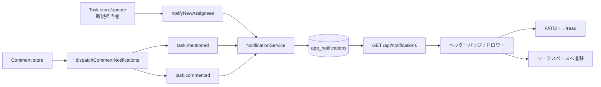

# アプリ内通知（Notification）

## 概要

ユーザー向けの**アプリ内通知**機能。タスクの担当追加・コメント・メンションを契機に `app_notifications` へ同期的に永続化し、グローバルヘッダーのベルアイコンから右サイドドロワー（「お知らせ」）で一覧・既読・遷移する。

本機能は Laravel の `Notification` チャネルや Event / Listener / Job パイプラインを使わず、**コントローラ内から `NotificationService` を直接呼ぶ同期書き込み**である。ボード／WBS のリアルタイム同期（Reverb / Echo）とは独立しており、通知の配信に WebSocket は用いない。

## 本書の範囲

- アプリ内通知の設計・現行仕様（作成トリガー、データモデル、API、UI）
- 要件定義上の将来候補との差分（未実装分）

対象外:

- メール・プッシュ等の外部通知チャネル（未実装）
- ボード／タスクのリアルタイム同期（[`../architecture/realtime-sync.md`](../architecture/realtime-sync.md)）

関連要件: [`../requirements/tasks.md`](../requirements/tasks.md) の「通知」節。

---

## 全体フロー

```
[ タスク作成・更新（担当追加） ]
[ コメント投稿（メンション含む） ]
        │ コントローラ内で同期呼び出し
        ▼
[ NotificationService ]
        │ INSERT
        ▼
[ app_notifications ]
        │
        ▼
[ GET /api/notifications ]  ← ヘッダーが 60 秒ポーリング / ドロワー開時に再取得
        │
        ▼
[ AppGlobalHeader お知らせドロワー ]
        │ クリック
        ▼
[ PATCH …/read ] → ワークスペース画面へ遷移
```



---

## データモデル

### テーブル: `app_notifications`

マイグレーション: `backend/database/migrations/2026_07_31_000004_create_notifications_table.php`  
モデル: `backend/app/Models/AppNotification.php`

| 列 | 型 | 説明 |
| --- | --- | --- |
| `id` | bigint PK | |
| `user_id` | FK → `users` | 受信者。`cascadeOnDelete` |
| `type` | string(64) | 通知種別（後述） |
| `data` | json | 遷移・表示用ペイロード |
| `read_at` | timestamp nullable | `null` = 未読 |
| `created_at` / `updated_at` | timestamp | |

インデックス: `(user_id, read_at, created_at)`

Eloquent:

- `data` → `array` cast
- `read_at` → `datetime` cast
- `user()` BelongsTo
- `isRead()`: `read_at !== null`
- `User::appNotifications()` HasMany

通知は**ユーザー単位**で保持する（組織スコープのフィルタは一覧 API に無い）。1 ユーザーが複数組織に属していても、一覧は全組織分が混在する。

---

## 通知種別と作成トリガー

永続化はすべて `App\Services\NotificationService` 経由。

| `type` | 作成タイミング | 受信者 | 除外 |
| --- | --- | --- | --- |
| `task.assigned` | タスク作成／更新で**新たに追加された**担当者 | 追加された担当者 ID 群 | 操作者（自己割当では通知しない） |
| `task.mentioned` | コメント新規作成時、本文のメンション | ワークスペースアクセス可能な被メンションユーザー | コメント投稿者 |
| `task.commented` | コメント新規作成時 | 当該タスクの**現在の全担当者** | コメント投稿者 |

### `task.assigned`

- 呼び出し元: `TaskController` の store / update → `notifyNewAssignees`
- 対象は `array_diff(after, before)` の**新規追加分のみ**。担当外しでは通知しない
- 操作者（`auth()->id()`）は除外する。自己割当では通知を作らない
- 担当者は事前にワークスペースアクセス検証済み（不正 ID は 422 等で弾かれ、通知まで到達しない）

### `task.mentioned` / `task.commented`

- 呼び出し元: `TaskCommentController::store` のみ（コメント更新・削除では作らない）
- メンション記法: `@[表示名](user:123)`（ルーティングは **user ID** が正。表示名は無視）
- 被メンション者が `canAccessWorkspace` を満たさない場合は通知しない
- 担当者かつメンション対象の場合、`task.mentioned` と `task.commented` の**両方が作成される**（種別間の重複排除なし）
- 担当者が空なら `task.commented` は作られない
- 起票者・ウォッチャー専用の通知は無い（担当 or メンションのみ）

### `data` ペイロード

| フィールド | `task.assigned` | `task.mentioned` / `task.commented` |
| --- | --- | --- |
| `task_id` | ○ | ○ |
| `workspace_id` | ○ | ○ |
| `organization_slug` | ○ | ○ |
| `title` | ○（タスクタイトル） | ○ |
| `comment_author_id` | — | ○ |

---

## NotificationService

ファイル: `backend/app/Services/NotificationService.php`

| メソッド | 挙動 |
| --- | --- |
| `notify($user, $type, $data)` | 1 行 INSERT |
| `notifyMany($users, $type, $data, ?$exceptUserId)` | ID 正規化・重複除去・除外ユーザーをスキップして各 `notify` |

キュー投入・バッチ・失敗リトライは無い（リクエスト内同期）。

---

## API

認証: `cognito` ミドルウェア（セッション）。組織メンバーシップミドルウェアは付けない（ユーザー個人の通知箱）。

ルート定義: `backend/routes/api.php`  
コントローラ: `backend/app/Http/Controllers/Api/NotificationController.php`

| Method | Path | 説明 |
| --- | --- | --- |
| `GET` | `/api/notifications` | 自分宛一覧（`created_at` 降順）。ページング: `page`, `per_page`（既定 30、上限 100） |
| `PATCH` | `/api/notifications/{notification}/read` | 単件既読。他人の ID は **404**。既に既読なら冪等 |
| `POST` | `/api/notifications/read-all` | 自分の未読を一括既読 |

### 一覧レスポンス

```json
{
  "data": [
    {
      "id": 1,
      "type": "task.assigned",
      "data": {
        "task_id": 10,
        "workspace_id": 3,
        "organization_slug": "acme",
        "title": "仕様レビュー"
      },
      "read_at": null,
      "created_at": "2026-06-18T12:34:56.000000Z"
    }
  ],
  "meta": {
    "page": 1,
    "per_page": 30,
    "total": 1,
    "last_page": 1,
    "q": null
  }
}
```

`q` クエリは ListQuery 経由で meta に載るが、通知検索カラムは未実装。

### 認可

| 操作 | ルール |
| --- | --- |
| 一覧 / 一括既読 | 認証ユーザー自身の `user_id` に限定 |
| 単件既読 | 所有者以外は 404（403 ではない）。Policy クラスは無し |
| 作成 | タスク／コメント API の既存認可の副作用。メンションは追加でワークスペースアクセスを確認 |

---

## フロントエンド

### UI

- コンポーネント: `frontend/app/components/app/AppGlobalHeader.vue`
- スタイル: `frontend/app/assets/styles/components/app/AppGlobalHeader.scss`

| 要素 | 仕様 |
| --- | --- |
| トリガー | ベルアイコン。未読数バッジ（99+ キャップ）。クライアント側で `read_at == null` を集計 |
| パネル | 右側フルハイトのサイドドロワー（Teleport）。タイトル「お知らせ」、右上 ✕ |
| 閉じ方 | ✕ / オーバーレイ外クリック（mousedown→mouseup のバックドロップ閉じ） / Escape |
| 各行 | 日付 `YYYY/MM/DD(曜)` → 本文（最大 2 行 clamp） → 右シェブロン |
| 文言 | `task.assigned` / `task.mentioned` / `task.commented` ごとに日本語ラベル |

### 取得・ポーリング

- マウント時に `GET /notifications`
- 以降 **60 秒間隔**でポーリング
- ドロワーを開いたときにも再取得
- WebSocket 購読は無し

### クリック時挙動

1. 未読なら `PATCH /notifications/{id}/read`
2. ドロワーを閉じる
3. `organization_slug` と `workspace_id` があれば `/org/{slug}/workspaces/{workspaceId}` へ遷移

**現状、タスク詳細までは開かない**（`task_id` はナビに未使用）。

### API とのギャップ（UI）

- `POST /notifications/read-all`（一括既読）はバックエンドにあるが、ドロワー UI からは未接続

---

## 要件との差分

[`../requirements/tasks.md`](../requirements/tasks.md) が挙げる発行イベントのうち、**実装済み**は次のみ。

| 要件上のイベント | 実装 |
| --- | --- |
| 担当者変更（追加） | ○ `task.assigned` |
| コメント追加 | ○ `task.commented` |
| メンション | ○ `task.mentioned` |
| タスク作成（一般） | ×（作成時の担当追加分のみ） |
| 期限超過 | × |
| `status=done` への変更 | × |
| メール等の外部通知 | × |
| 起票者への基本通知 | ×（担当・メンション以外は無し） |
| 同一イベントの短時間重複抑止 | △（`notifyMany` 内の ID 重複除去のみ。種別横断・時間窓の抑止は無し） |

---

## 主要ファイル一覧

| 役割 | パス |
| --- | --- |
| モデル | `backend/app/Models/AppNotification.php` |
| サービス | `backend/app/Services/NotificationService.php` |
| API | `backend/app/Http/Controllers/Api/NotificationController.php` |
| 作成（担当） | `backend/app/Http/Controllers/Api/TaskController.php` |
| 作成（コメント） | `backend/app/Http/Controllers/Api/TaskCommentController.php` |
| ルート | `backend/routes/api.php` |
| マイグレーション | `backend/database/migrations/2026_07_31_000004_create_notifications_table.php` |
| Feature テスト | `backend/tests/Feature/NotificationsAndAttachmentsApiTest.php` |
| UI | `frontend/app/components/app/AppGlobalHeader.vue` |
| UI スタイル | `frontend/app/assets/styles/components/app/AppGlobalHeader.scss` |

---

## 今後の拡張候補（参考）

実装を増やす場合の論点（現状未着手）。

- タスク詳細へのディープリンク（`task_id` + モーダル／フォーカス）
- 一括既読 UI の接続
- 期限超過・完了・起票者向けなど要件未実装イベント
- ポーリングからリアルタイム（専用チャネル or 既存 Reverb）への移行
- 組織コンテキストでの一覧フィルタ
- `task.mentioned` と `task.commented` の受信者重複統合
